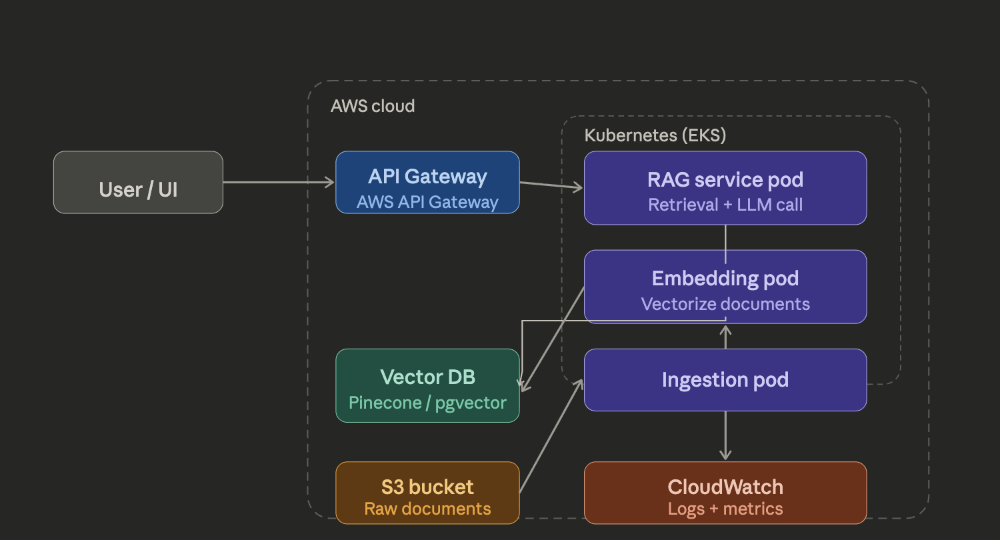
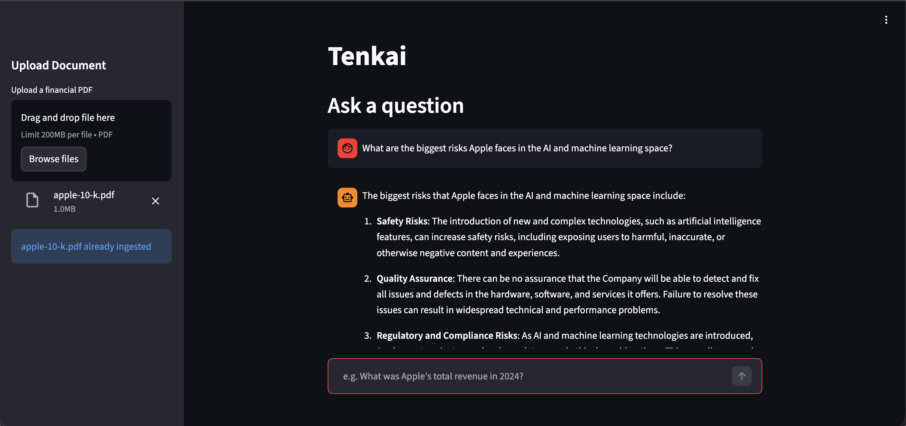
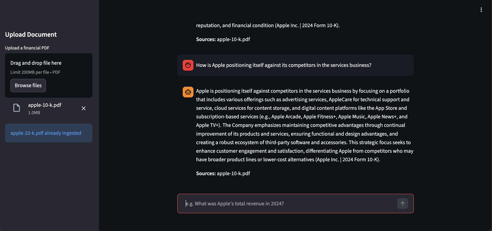
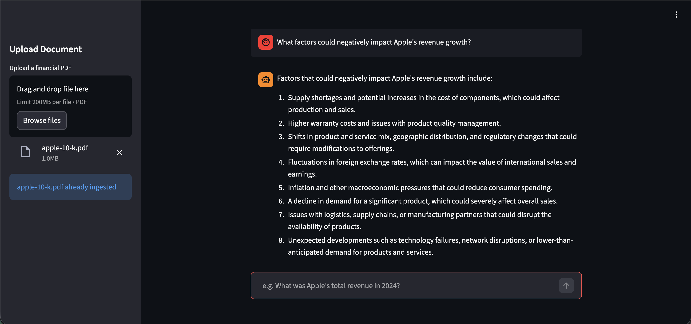
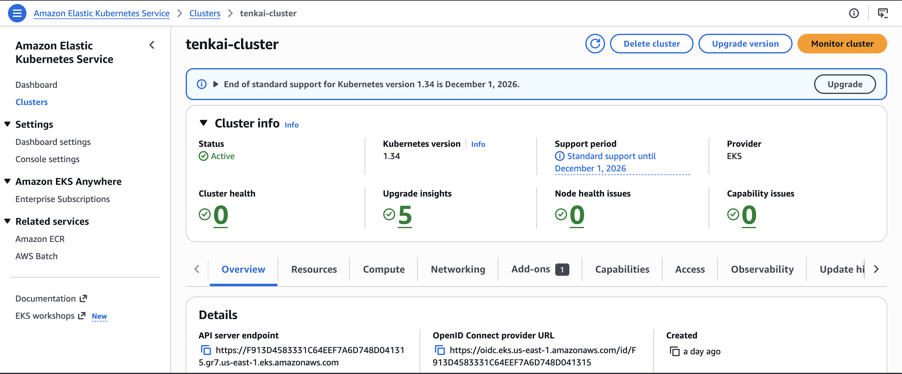
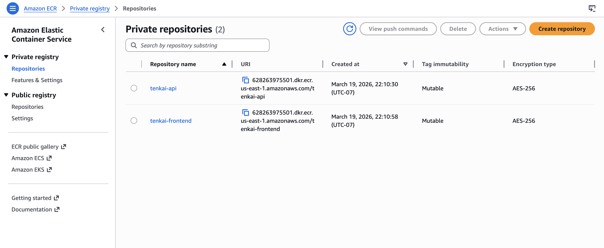
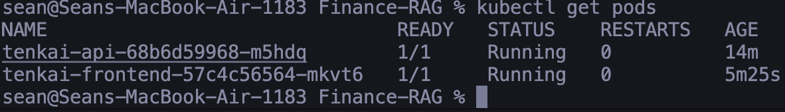
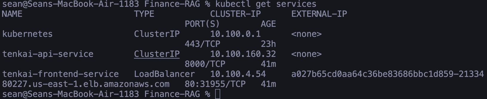

# Tenkai 📈

> **RAG-powered financial research assistant.** Ask natural language questions about financial documents and get grounded, cited answers.


**Live Demo:** [tenkai-frontend.onrender.com](https://tenkai-frontend.onrender.com)

> The app was originally deployed on AWS EKS with a Kubernetes-managed load balancer for production-grade orchestration (see screenshots below). It was subsequently migrated to Render's free tier to keep a persistent live link without incurring ongoing AWS costs. The full EKS deployment is documented and reproducible from the instructions in this README.

---

## What is Tenkai?

Tenkai is a full-stack RAG (Retrieval-Augmented Generation) application that lets users upload financial PDFs such as earnings reports, 10-K filings, and annual reports, then ask natural language questions about them. The system retrieves the most semantically relevant document chunks and passes them to an LLM to generate grounded, cited answers.

Built as a portfolio project targeting the intersection of modern ML infrastructure and financial services, Tenkai demonstrates end-to-end MLOps: from document ingestion and vector embeddings to containerized cloud deployment on Kubernetes.

---

## Architecture



The system is composed of two services deployed as separate Kubernetes pods:

- **API service** - FastAPI backend handling document ingestion, embedding, vector search, and LLM calls
- **Frontend service** - Streamlit UI for document upload and conversational querying

Both services are containerized with Docker, stored in AWS ECR, and orchestrated on AWS EKS.

---

## How It Works

**1. Document Ingestion**
The user uploads a financial PDF. The backend extracts text using `pypdf`, chunks it into overlapping 500-word segments, and generates vector embeddings using OpenAI's `text-embedding-3-small` model.

**2. Vector Storage**
Each chunk and its embedding are upserted into a Pinecone serverless index with metadata including the source filename. This enables fast semantic similarity search at query time.

**3. RAG Query Pipeline**
When the user asks a question, the query is embedded using the same model. Pinecone returns the top-5 most semantically similar chunks. These chunks are injected into an LLM prompt as context, and `gpt-4o-mini` generates a grounded answer with document citations.

**4. Response**
The frontend displays the answer alongside the source document, demonstrating the system is grounded in the uploaded material and not hallucinating.

---

## Demo

| Asking about Apple's AI risks | Competitive positioning |
|---|---|
|  |  |



---

## AWS Cloud Infrastructure

| Service | Role |
|---|---|
| **ECR** | Private Docker image registry for API and frontend containers |
| **EKS** | Managed Kubernetes cluster orchestrating both service pods |
| **EC2 (t3.small)** | Worker nodes running the Kubernetes pods |
| **ELB** | Load balancer exposing the frontend service to the public internet |




### Kubernetes Deployment

Both services are defined as Kubernetes `Deployment` + `Service` pairs. The frontend is exposed via a `LoadBalancer` service, while the API uses `ClusterIP` for internal pod-to-pod communication.

```bash
kubectl get pods
# NAME                               READY   STATUS    RESTARTS   AGE
# tenkai-api-68b6d59968-m5hdq        1/1     Running   0          14m
# tenkai-frontend-57c4c56564-mkvt6   1/1     Running   0          5m25s

kubectl get services
# tenkai-frontend-service   LoadBalancer   ...   a027b65cd0aa64c36be83686bbc1d859-2133480227.us-east-1.elb.amazonaws.com
```




---

## Tech Stack

| Layer | Technology |
|---|---|
| **LLM** | OpenAI `gpt-4o-mini` |
| **Embeddings** | OpenAI `text-embedding-3-small` (1536 dimensions) |
| **Vector DB** | Pinecone serverless (cosine similarity) |
| **Backend** | FastAPI + uvicorn |
| **Frontend** | Streamlit |
| **PDF parsing** | pypdf |
| **Containerization** | Docker + Docker Compose |
| **Container Registry** | AWS ECR |
| **Orchestration** | Kubernetes on AWS EKS |
| **Deployment (live)** | Render (free tier) |

---

## Prerequisites

- Python 3.11+
- Docker Desktop
- AWS CLI (for ECR/EKS deployment)
- `kubectl` and `eksctl` (for Kubernetes deployment)

---

## Running Locally

**1. Clone the repo**
```bash
git clone https://github.com/seanlouie24/Finance-RAG.git
cd Finance-RAG
```

**2. Create virtual environment**
```bash
python3 -m venv venv
source venv/bin/activate
pip install -r requirements.txt
```

**3. Set up environment variables**

Create a `.env` file in the project root:
```env
OPENAI_API_KEY=your_openai_key_here
PINECONE_API_KEY=your_pinecone_key_here
PINECONE_INDEX=your_index_name_here
```

**4. Run with Docker Compose**
```bash
docker compose up --build
```

- API: `http://localhost:8000`
- Frontend: `http://localhost:8501`
- API docs: `http://localhost:8000/docs`

---

## Running Without Docker

In two separate terminals:

**Terminal 1 - API**
```bash
source venv/bin/activate
uvicorn app.main:app --reload
```

**Terminal 2 - Frontend**
```bash
source venv/bin/activate
streamlit run streamlit_app.py
```

---

## API Reference

Base URL: `http://localhost:8000`

### `POST /ingest`
Upload a financial PDF and ingest it into the vector database.

**Request:** `multipart/form-data` with `file` field (PDF)

**Response:**
```json
{
  "ingested": "apple-10-k.pdf",
  "chunks": 144
}
```

### `GET /query`
Ask a natural language question about ingested documents.

**Query Parameters:** `q` - your question

**Response:**
```json
{
  "answer": "Apple's total revenue in 2024 was $391,035 million...",
  "sources": ["apple-10-k.pdf"]
}
```

---

## Kubernetes Deployment (AWS EKS)

**1. Create EKS cluster**
```bash
eksctl create cluster \
  --name tenkai-cluster \
  --region us-east-1 \
  --nodegroup-name tenkai-nodes \
  --node-type t3.small \
  --nodes 2 \
  --managed
```

**2. Push images to ECR**
```bash
aws ecr get-login-password --region us-east-1 | docker login --username AWS --password-stdin <account-id>.dkr.ecr.us-east-1.amazonaws.com

docker buildx build --platform linux/amd64 \
  -t <account-id>.dkr.ecr.us-east-1.amazonaws.com/tenkai-api:latest --push .
```

**3. Deploy to cluster**
```bash
kubectl apply -f k8s/
kubectl get pods
kubectl get services
```

---

## Project Structure

```
Finance-RAG/
├── app/
│   ├── main.py              # FastAPI app entry point
│   ├── routers/
│   │   └── query.py         # /ingest and /query endpoints
│   └── services/
│       ├── rag.py           # Embedding + vector search + LLM call
│       └── ingest.py        # PDF parsing + Pinecone upsert
├── k8s/
│   ├── api-deployment.yaml       # Kubernetes API deployment + service
│   └── frontend-deployment.yaml  # Kubernetes frontend deployment + service
├── streamlit_app.py         # Streamlit frontend
├── Dockerfile               # Container definition
├── docker-compose.yml       # Local multi-service orchestration
├── requirements.txt
└── .env                     # API keys (not committed)
```

---

## Environment Variables

| Variable | Description |
|---|---|
| `OPENAI_API_KEY` | OpenAI API key for embeddings and chat completions |
| `PINECONE_API_KEY` | Pinecone API key for vector database access |
| `PINECONE_INDEX` | Name of your Pinecone index |
| `API_URL` | Backend URL for frontend (default: `http://localhost:8000`) |

> Never commit your `.env` file. Make sure it is listed in `.gitignore`.

---
